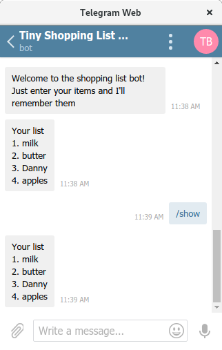

# ke$plit

Money splitter bot that helps you  manage your expenses in a group

* Elane Felsenthal
* Hadas Wittow
* Miriam Gottshalk

{OPTIONAL: MORE PROJECT INFO HERE}

## Screenshots

## How to Run This Bot
### Prerequisites
* Python 3.7
* Pipenv
* MongoDB

### Setup
* Clone this repo from github
* Install dependencies: `pipenv install`
* Get a BOT ID from the [botfather](https://telegram.me/BotFather).
* Create a `secret_settings.py` file:

        BOT_TOKEN = "your-bot-token-here"

## Credits and References
* Telegram Docs
* python-telegram-bot
* Stack overflow
* Github
* Friends in class

